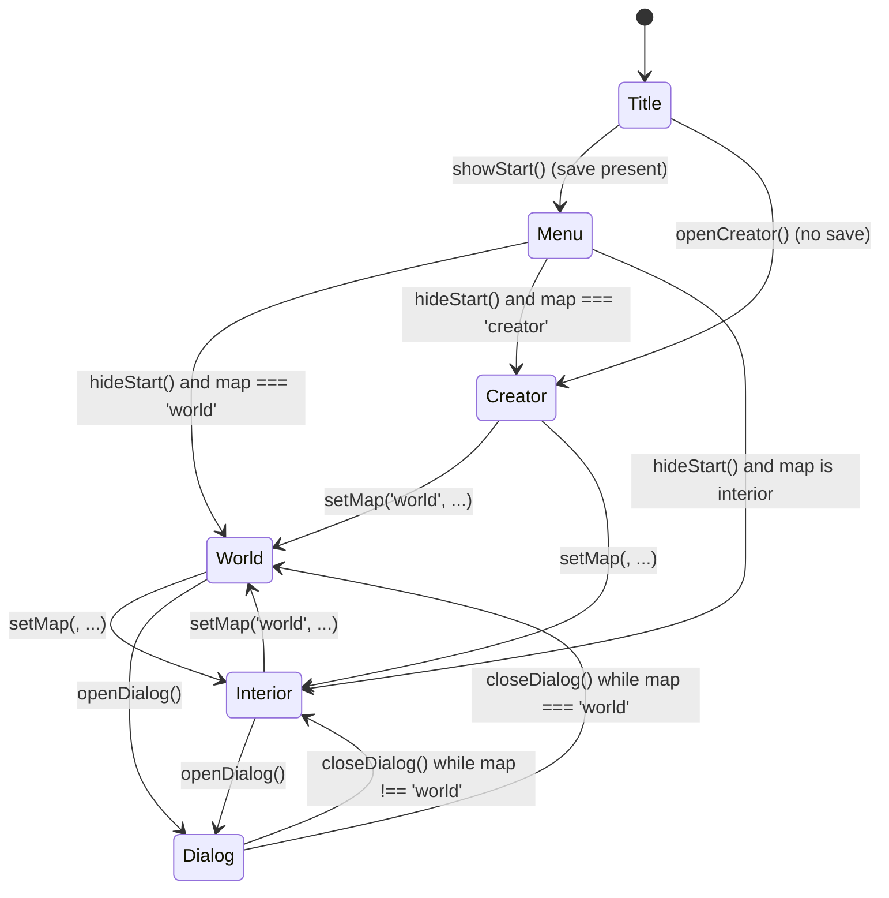

# Game State Machine Overview

Dustland's runtime keeps a small finite state machine to drive high-level UI flows and gate player input. The core states are defined in `ts-src/scripts/dustland-core.ts` and cover the title screen, start menu, character creator, overworld exploration, interior spaces, and dialog overlays.【F:ts-src/scripts/dustland-core.ts†L490-L499】 This document summarizes those states and their transitions.

## Boot flow

* On load, the engine checks for a saved game. If a save exists it opens the start overlay via `showStart()`, moving the machine from the initial `title` state into the `menu` state. Without a save, it immediately launches the character creator via `openCreator()`, transitioning from `title` to `creator`.【F:ts-src/scripts/dustland-engine.ts†L3706-L3721】【F:ts-src/scripts/dustland-core.ts†L490-L499】【F:ts-src/scripts/dustland-core.ts†L1825-L1833】

## Menu transitions

* `showStart()` displays the start overlay and forces the machine into the `menu` state. Closing the overlay through `hideStart()` returns to whichever map state was active (`world`, `interior`, or `creator`). Choosing "New Game" also invokes `resetAll()`, which resets progress and reopens the creator, keeping the state machine on the `creator` branch after the overlay closes.【F:ts-src/scripts/dustland-core.ts†L1691-L1707】 
* Selecting "Continue" calls `load()` before `hideStart()`. Once the save loads, `setMap(state.map)` re-enters the stored map, triggering the matching state via the map transition logic described below.【F:ts-src/scripts/dustland-core.ts†L1492-L1499】

## Map-driven transitions

* `setMap()` centralizes map changes. It assigns the active map and derives the corresponding state: `world` for the overworld, `creator` for the builder map, or `interior` for everything else.【F:ts-src/scripts/dustland-core.ts†L305-L320】 Any feature that changes maps—module start points, fast travel, or interior portals—ultimately flows through this helper.

## Dialog overlay

* Opening an NPC dialog calls `openDialog()`, which shows the dialog overlay and switches the machine to the `dialog` state. Closing the dialog via `closeDialog()` hides the overlay and returns to `world` or `interior` depending on the active map.【F:ts-src/scripts/core/dialog.ts†L500-L536】 This keeps conversations modal while preserving the underlying exploration context.

## Creator loop

* The character creator displays in the `creator` state. `openCreator()` assigns the temporary creator map through `setMap('creator', 'Creator')`, so any exit from the creator—whether starting the adventure or resetting—eventually calls into the same map logic that routes to `world` or an interior once the module places the party.【F:ts-src/scripts/dustland-core.ts†L1825-L1833】【F:ts-src/scripts/dustland-core.ts†L305-L320】

## Summary

Together these transitions form a compact, map-driven state machine. Boot flow determines whether players start in the menu or jump straight into creation. From there, every map change moves between overworld and interior states, while dialogs temporarily supersede exploration until dismissed. Keeping these transitions centralized in `setMap()` and the dialog helpers simplifies reasoning about UI overlays and input routing.
