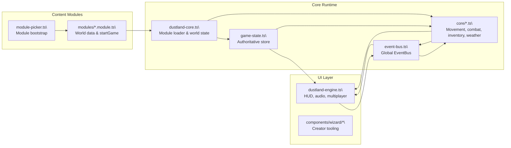

# Dustland TypeScript Runtime Diagram

This diagram illustrates how the Dustland TypeScript runtime pieces fit together.

## System overview

- **Event-driven backbone (`ts-src/scripts/event-bus.ts`)**  
  A tiny pub/sub bus is registered on `globalThis.Dustland` and mirrored as `globalThis.EventBus`, giving every subsystem a shared messaging hub via `on`, `off`, and `emit` handlers.
- **UI, HUD, and multiplayer shell (`ts-src/scripts/dustland-engine.ts`)**  
  The engine script binds DOM elements, centralizes logging, wraps browser audio, exposes mobile controls, and listens to EventBus topics such as `skin:changed`, `sfx`, `weather:change`, and persona or movement updates to keep the HUD and feedback layers in sync with gameplay and multiplayer presence events.
- **Authoritative game state store (`ts-src/scripts/game-state.ts`)**  
  A closure-scoped `state` object tracks party members, inventory, quests, personas, NPC memory, and difficulty; helper functions mutate the store and broadcast `state:changed` or persona events through the EventBus to trigger UI refreshes.
- **Core runtime & module loader (`ts-src/scripts/dustland-core.ts`)**  
  `applyModule` resets global collections, seeds deterministic RNG, rebuilds terrain, registers interiors, and caches module metadata before handing control back to systems; it coordinates Dustland’s behavior, effects, and persona templates under the selected module.
- **Procedural world generation (`ts-src/scripts/procedural-map.ts`)**  
  Noise-based helpers (`generateHeightField`, `heightFieldToTiles`, `refineTiles`) build tile grids from seeds, giving modules deterministic overworld layouts without external dependencies.
- **Gameplay systems (`ts-src/scripts/core/*.ts`)**  
  Modules like `movement.ts` watch EventBus topics (e.g., `combat:started`, `weather:change`) to gate input, advance world turns, restock NPC shops, and update encounter logic, showing how each subsystem reacts to shared events.
- **Module-specific behaviors (`ts-src/scripts/core/module-behaviors.ts`)**  
  A behavior manager attaches conditional handlers for step unlocks, arenas, and other scripted effects by wiring module data into EventBus listeners and registering cleanups during teardown.
- **Content pipeline (`ts-src/scripts/module-picker.ts` & `ts-src/modules/*.module.ts`)**  
  The module picker loads individual adventures, injects their scripts, and calls the exported `startGame`, which posts processes the JSON payload and invokes `applyModule` to populate the world and position the party.

## Diagram

