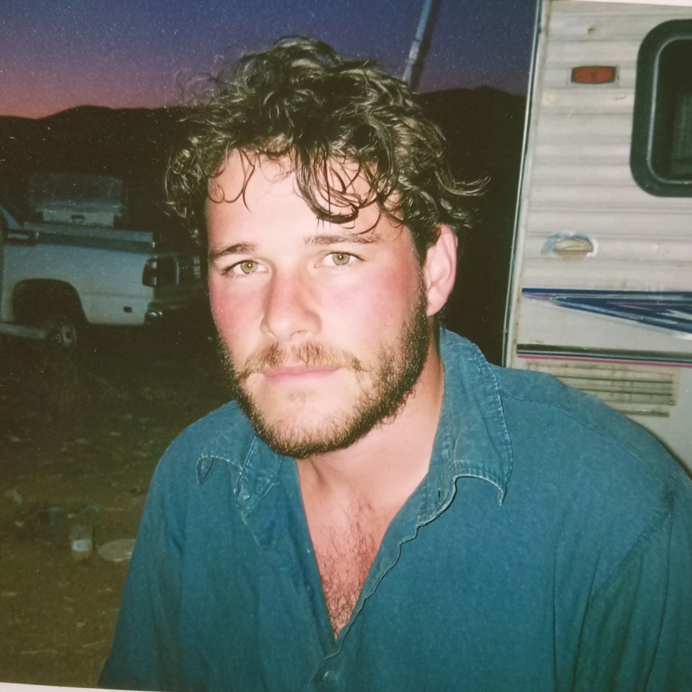
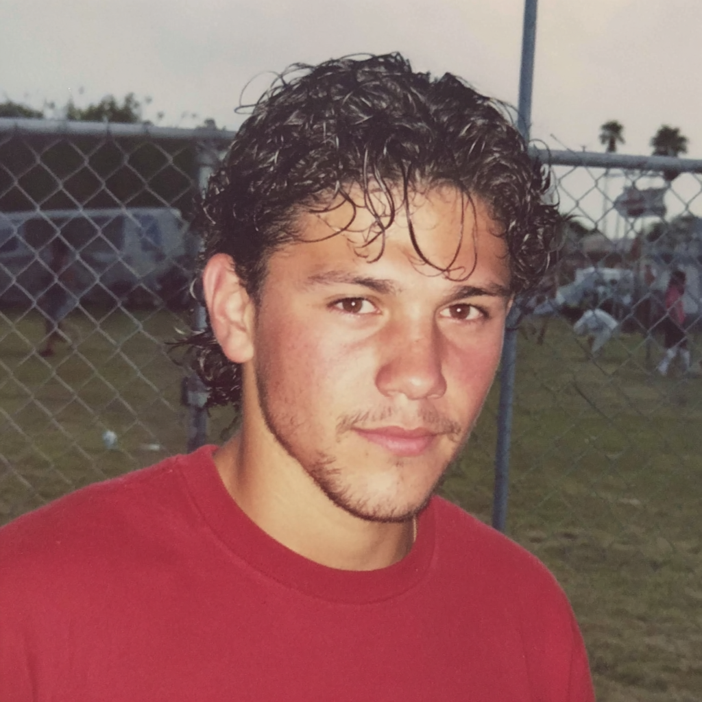

# Team Bios

## Riley "Clown" Morgan

- **Background:** Hacker-artist steering our neon wasteland carnival.
- **Skills:** Mod-friendly coding, quick sketches, collaborative worldbuilding.
- **Interests:** Cyberpunk runs, doppelgängers, open-source mischief.
- **Contributions:** Drafted the Spoils Caches loot system for post-fight rewards.

## Alex "Echo" Johnson

- **Background:** Former indie comics writer who migrated to games to build interactive stories.
- **Skills:** World-building, character arcs, moody dialogue.
- **Interests:** Dystopian caravans, synth music, dusty sunsets.
- **Contributions:** Shaped fast-travel bunkers, dynamic weather, persona masks, the True Dust module, and plot outlines.

## Priya "Gizmo" Sharma

- **Background:** Tools engineer obsessed with clean pipelines and happy teammates.
- **Skills:** Debugging, editor automation, modular architecture.
- **Interests:** Accessible UIs, open-source gadgets, spicy snacks.
- **Contributions:** Planned multiplayer sessions, trader economy tweaks, HUD and trainer UI passes, creator wizards, and tech-debt cleanup.

## Mateo "Wing" Alvarez

- **Background:** Ex-speedrunner who designs encounters with a stopwatch in hand.
- **Skills:** Combat tuning, user testing, rapid iteration.
- **Interests:** High-tempo action, fair challenges, retro mechs.
- **Contributions:** Pitched combat overhaul, hydration mechanics, and RPG progression revamps.

